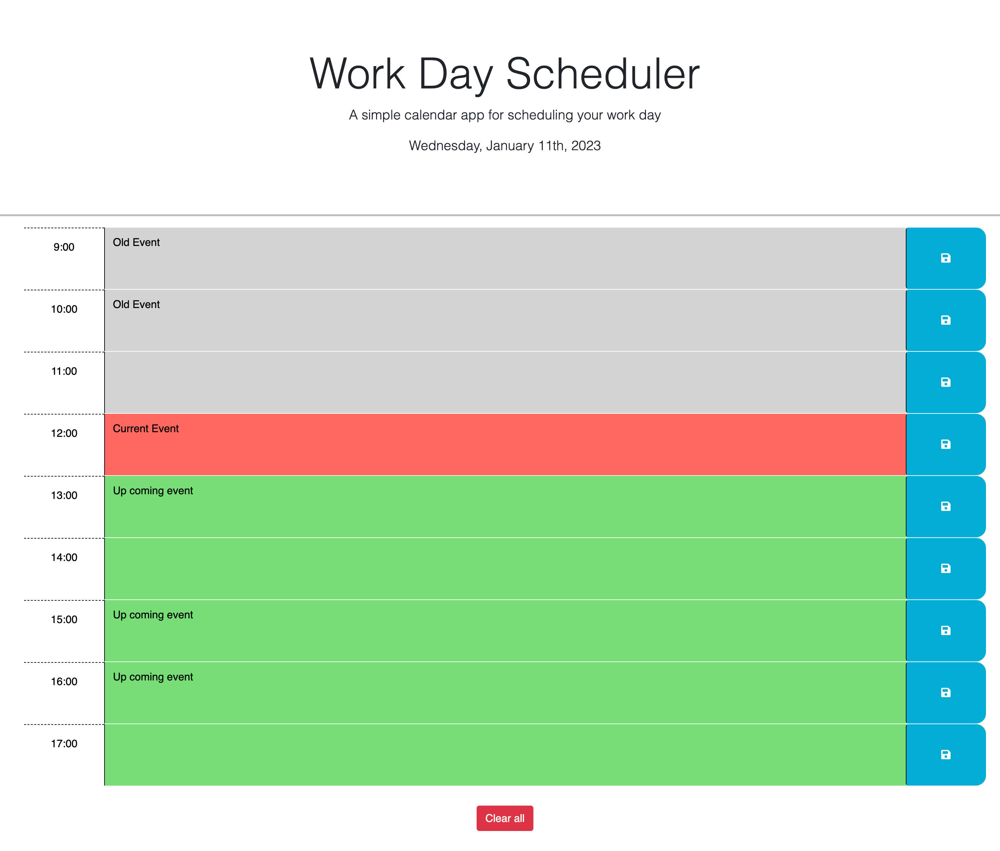

# Homework 05: Work Day Scheduler

## Description

A simple calendar application that user can save working events/plans for each hour of the current day. Modifying the starter code with js, jquery and day.js.

### Additional feature:

- User can clear specific hour event or clear all the current events.
- Show alert if user hit save when not enter anything.

## Links

- Here is the link to access simple work day scheduler app: [Work day scheduler](https://github.com/christopher211/work-day-scheduler/)

- The repo of the app: [Source Code](https://github.com/christopher211/work-day-scheduler.git)

## User Story

```md
AS AN employee with a busy schedule
I WANT to add important events to a daily planner
SO THAT I can manage my time effectively
```

## Acceptance Criteria

```md
GIVEN I am using a daily planner to create a schedule
WHEN I open the planner
THEN the current day is displayed at the top of the calendar
WHEN I scroll down
THEN I am presented with timeblocks for standard business hours
WHEN I view the timeblocks for that day
THEN each timeblock is color coded to indicate whether it is in the past, present, or future
WHEN I click into a timeblock
THEN I can enter an event
WHEN I click the save button for that timeblock
THEN the text for that event is saved in local storage
WHEN I refresh the page
THEN the saved events persist
```

The following animation demonstrates the application functionality:

## Screenshot & demo preview




